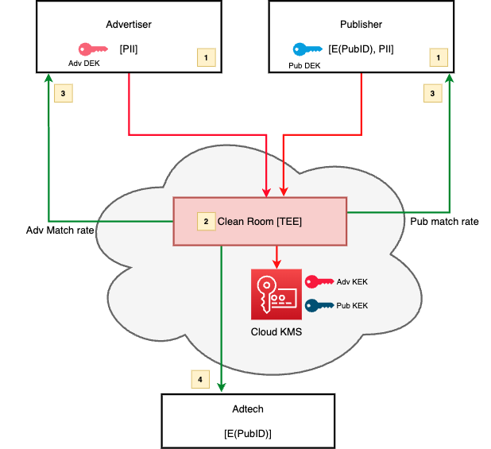

# Trusted Execution Environments: Example Use Case and Code Samples

## Introduction

We have shared our perspective on the design and architecture of trusted-execution environments for use cases ranging from data minimization to aggregation across both batch and stream processing. Common primitives such as JOINs and aggregations functions (e.g., SUM, COUNT) can be built, composed, and scaled to meet the needs of numerous disparate use cases. As an example, we will provide an open source code repository for a simple joiner. This joiner may need modification based on the scale and needs of the use case. Nevertheless, this repository demonstrates the simplicity in which powerful use cases can be encapsulated into trusted data flows. We will consider a re-imagining of the PAIR use case which has previously been shared with the IAB Tech Lab.

### Case Study: PAIR

In 2022, Google announced Publisher Advertiser Identity Reconciliation, or [PAIR](https://blog.google/products/marketingplatform/360/engage-your-first-party-audience-in-display-video-360/), as a method for advertisers and publishers to effectively reach known audiences without relying on third party cookies. Specifically, PAIR seeks to maintain the relationship between publishers and advertisers where publishers maintain disjointed identity spaces. As the ecosystem evolves and demand increases for such solutions, we seek to identify scaled, secure solutions which are extensible. In the PAIR ecosystem, we can foresee the need to measure the effectiveness of campaigns and the possibility of expanding remarketing from 1:1 into lookalike models by matching on user attributes like demographics or interests.

With security, privacy, and extensibility in mind, we seek a scaled privacy-safe mechanism to exchange first party identifiers powering these use cases without the need for universal identifiers or graphs. We propose a generalized solution anchored on the same concepts of distributed trust and secure, privacy-safe computing as other emerging solutions in the market.

#### Goals and Threat Model

Given the sensitivity of the data being exchanged, we are committed to establishing a high bar for data security and privacy. Specifically we want to ensure that:

*   No stakeholder in the data exchange can act alone to access or exfiltrate cleartext personal information, including the administrator
*   Limit or eliminate cross-learning between publisher, advertisers, exchange administrators, and the real-time bidding stack
*   Safeguard against the real-time bidding stack from reverse engineering user identities

#### Single Clean Room Exchange

Data is commonly exchanged between publishers and advertisers within the same clean room. Since this data is personally identifiable first party data (1PD), we seek to limit the number of parties with access to the data. We see solutions emerging anchored on confidential compute hardware (e.g., the Chrome Privacy Sandbox) and propose a solution similar to that framework. This solution anchors in distributed assets such that all parties must adhere to the protocol, else data will not be decrypted or processed. We outline the solution below:

Both advertiser and publisher agree to the processing logic that will process the personal data. They can seal the data in such a way that only the agreed upon processing logic can use the data for processing in a secure environment.

*   The advertiser generates a data encryption key (Adv DEK) and encrypts the PII.
*   Advertiser also encrypts the Adv DEK with Key Encryption Key (Adv KEK) and configures the KEK to only allow decryption operation to a Trusted Execution Environment running specific logic.
*   The Advertiser sends the encrypted PII to the single clean room.
*   The publisher generates a data encryption key(Pub DEK) and encrypts the PII. They send the encrypted PII as well as Publisher generated ID (PubID) to the single clean room.
*   The cleanroom decrypts the Adv DEK by making a request to the Key Management Service (KMS) owning the KEK and providing the attestation document proving the confidential hardware, the processing binary and other attributes. Cleanroom decrypts the advertiser PII
*   The cleanroom decrypts the Pub DEK by making a request to the KMS Service owning the KEK and providing the attestation document proving the confidential hardware, the processing binary and other attributes. Cleanroom decrypts the publisher PII.
*   The cleanroom can run the matching logic on the PII and match the inputs from publisher and advertiser.
*   The clean room sends the PubID of matched PIIs to the adtech and sends the match rates to the advertiser and publisher.

The PII data is owned by the advertiser and publisher respectively. It is always encrypted in transit and at rest. Only the TEE running specific hardware and binary can decrypt the data. The business logic is written in such a way that neither advertiser or publisher can do differential attacks on the system. Even the administrator of the clean room TEE cannot look into the memory or exfiltrate the data out of the TEE. The matched output PubIDs can only be sent to a well known endpoint of adtech. Neither publisher nor advertiser gets the matched PubIDs.

#### Solution Considerations

##### Privacy and Security

*   Publishers maintain control of their identity space and the identifiers which pass through the real-time bidding stack. We advise using strong encryption on the identifiers and rotating them at appropriate time intervals (e.g., every 30-days).
*   Difference set attack enforcement on PII can be done using structures like bloom filters, but these would need to be sealed to prevent administrators from conducting dictionary attacks against these structures. Thus, we believe for practical implementations, difference set attacks are most likely limited through policy, coarse-grained usage budgets, or noised match rates.

##### Extensibility

*   This solution supports large scale computation. While the matching algorithm can be implemented as an in-memory join, this may limit the supported data set sizes. Solutions to this may be requiring datasets to be sorted such that the match can be done as a merge-sort join or multiple servers could be used to implement a distributed, in-memory hash join.
*   The matching operation is generic and can be used to expand use cases. We can envision supporting measurement where publishers provide PII-keyed ad impressions and advertisers provide PII-keyed conversions. These can be matched and credit can be assigned accordingly. We can additionally envision the building block for lookalike expansion and publishers could provide ‘interest group’ data with each PII-keyed publisher ID. Advertisers can match to a seed group and expand to other users in similar interest groups in a privacy-safe way.

##### Dual Clean Room Exchange

Since PAIR is an open protocol and solution, advertisers and publishers may find their datasets residing in different clean rooms. This suggests the need for interoperability. We suggest the following approaches:

##### Storage Layer Interoperability

Confidential compute solutions lend themselves well to supporting cloud based storage. For example, solutions based on Google Confidential Spaces will work well with GCS storage. With a common schema and file format (e.g., &lt;pubID>,&lt;pubPII>), datasets within supported cloud based storage would be interoperable. Clean rooms could support x-cloud storage to cover the majority of the ecosystem. It is important to note a solution anchoring on a common schema and format does not require all clean rooms to use the same matching security paradigm or algorithm - only that the input and outputs of the system adhere to the standard.

##### Clean Room Exchange Protocol

A second option is for clean rooms to natively integrate and exchange data. The exchange protocol outlined [here](https://services.google.com/fh/files/misc/pair_visual_final_10242022.pdf) can be implemented without a hard requirement for confidential hardware usage.

##### Implementation Source Code

https://github.com/google-ads-confidential-computing/conf-data-processing-architecture-reference-sample

The shared source code is a foundational example, not designed for large-scale production and does not demonstrate key generation or encryption. The primary functionality shown is that of exchanging data between parties and performing matching logic in a secure environment. As a practical matter, each GCS storage source container can be configured to encrypt data at rest and access controls enabled such that only the providing party and the trusted execution environment can access the data. Further adjustments may be necessary, especially when working with substantial datasets.

#### Conclusion

This example demonstrates the simplicity, extensibility, and power of TEE-based solutions. We will continue to look for opportunities to seamlessly bring privacy and security assurances to data exchange use cases.
